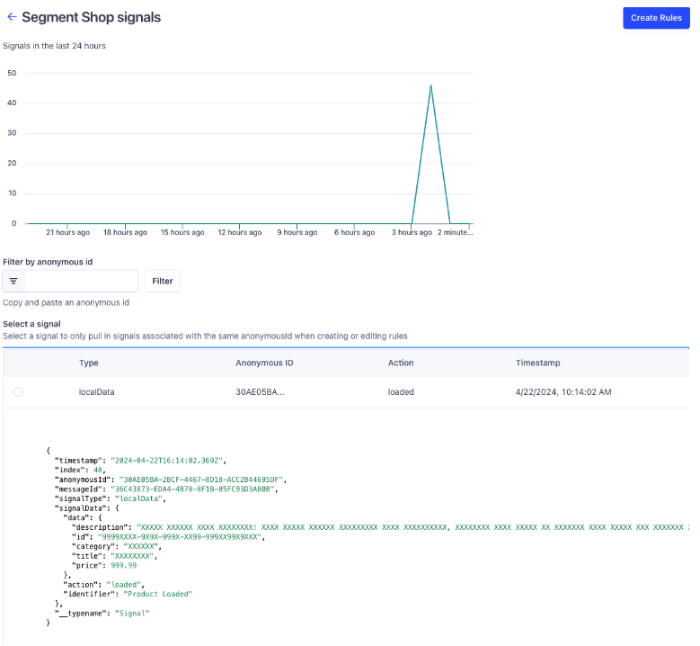

<!--- something about the SDK -->

## Step 1: Add a source and get its write key

You'll first need to add a source and copy its write key: 

1. In your Segment workspace, navigate to **Connections > Auto-Instrumentation** and click **Add source**.
2. Select a source, give the source a name, and click **Save**.
3. Return to **Connections > Sources** to view your sources. 
4. In the **My sources** table, find and click the new source you just set up.
5. In the **Initialize the Client** section, look for and copy the `writeKey` displayed in the code block. 

## Step 2: Add dependencies and initialization code

Next, you'll need to add the Signals SDKs to your development environment.

### Swift

Follow these steps to integrate the Signals SDK into your Swift application:

1. Use Swift Package Manager to add the Signals SDK from the following repository:

    ```zsh
    https://github.com/segmentio/Signals-swift.git
    ```

2. Add the initialization code:

    ```swift
    // Configure Analytics with your settings
    {... <analytics config>....} 

    // Set up the Signals SDK configuration
    let config = Signals.Configuration(
        writeKey: "<WRITE_KEY>",          // Replace <WRITE_KEY> with your actual write key
        maximumBufferSize: 100,
        useSwiftUIAutoSignal: true,
        useNetworkAutoSignal: true
    )

    // Locate and set the fallback JavaScript file for edge functions
    let fallbackURL = Bundle.main.url(forResource: "MyEdgeFunctions", withExtension: "js")

    // Apply the configuration and add the Signals plugin
    Signals.shared.useConfiguration(config)
    Analytics.main.add(plugin: LivePlugins(fallbackFileURL: fallbackURL))
    Analytics.main.add(plugin: Signals.shared)
    ```

Verify that you replaced `<WRITE_KEY>` with the actual write key you copied in Step 1.

### Kotlin

Follow these steps to integrate the Signals SDK into your Kotlin application: 

1. Update your module’s Gradle build file to add the right dependencies:

    ```kotlin
    dependencies {
        // Add the Analytics Kotlin library
        implementation("com.segment.analytics.kotlin:android:1.15.0")
        // Add a live plugin for real-time data handling
        implementation("com.segment.analytics.kotlin:analytics-kotlin-live:1.0.0")
        // Add the core Signals library
        implementation("com.segment.analytics.kotlin.signals:core:0.0.1")
        // Compose plugin for Jetpack Compose UI tracking
        implementation("com.segment.analytics.kotlin.signals:compose:0.0.1")
        // OkHttp3 plugin for network activity tracking
        implementation("com.segment.analytics.kotlin.signals:okhttp3:0.0.1")
    }
    ```

2. Add the following code to your application to initialize the Signals SDK:

    ```kotlin
    // Configure Analytics with your settings
    {... <analytics config>....} 

    // Add live plugins for real-time analytics
    analytics.add(LivePlugins())

    // Configure and add the Signals plugin
    Signals.configuration = Configuration(
        maximumBufferSize = 1000,
        broadcasters = listOf(SegmentBroadcaster(analytics))
    )

    // Add the Compose plugin for UI events and screen tracking
    analytics.add(SignalsComposeTrackingPlugin())
    ```

3. (Optional:) If you want to track network activity, configure your OkHttpClient to use the Signals OkHttp3 plugin:

    ```kotlin
    private val okHttpClient = OkHttpClient.Builder()
        .addInterceptor(SignalsOkHttp3TrackingPlugin())
        .build()
    ```

4. Build and run your app.


## Step 3: Verify and deploy events

Next, you'll need to verify signal emission and create rules to convert those signals into events:

1. In your Segment workspace, return to **Connections > Auto-Instrumentation** and click on the new source you created. 
2. Verify that signals appear as expected on the dashboard.

    

3. Click **Create Rules**.
4. In the Rules Editor, add a rule that converts signal data into an event.
5. Click **Preview**, then click **Save & Deploy**.

Segment displays `Rule updated successfully` to verify that it saved your rule.

## Step 4: Redeploy your application

After you've finiseh
