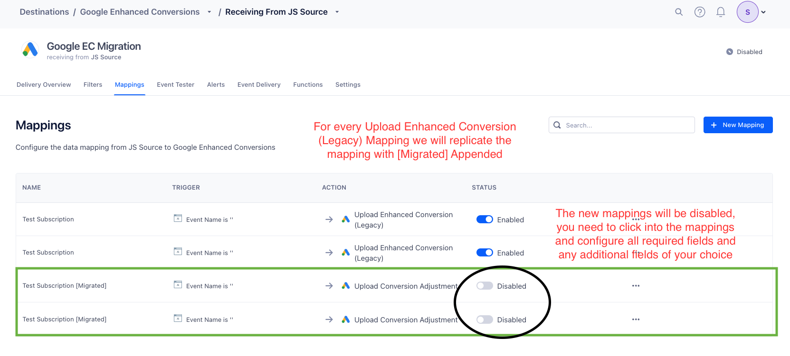
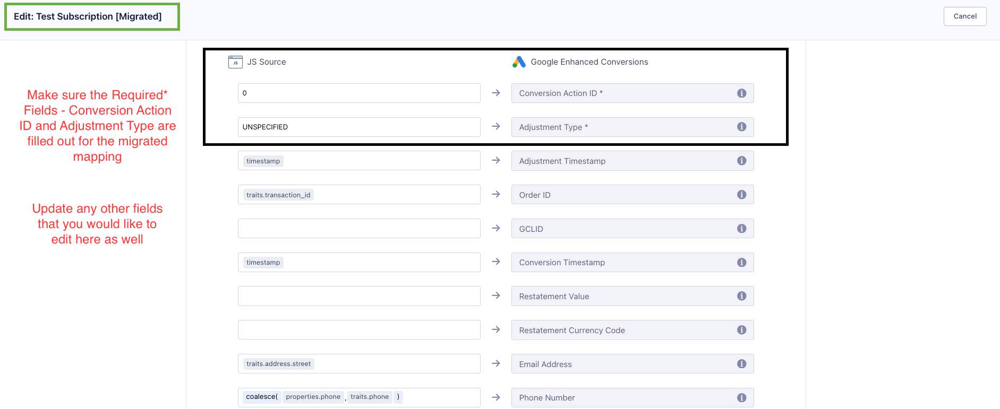

The Google Ads Conversions destination enables you to upload offline conversions and conversion adjustments to Google Ads in a privacy safe way. With this server-side destination, you can upload conversions to the [Google Ads API](https://developers.google.com/google-ads/api/docs/conversions/overview){:target="_blank"} and tie them to a user's online click or phone call. In addition, you can improve the accuracy of your conversion measurement by sending conversion enhancements, restatements, and retractions. 

> warning "Upload Enhanced Conversion (Legacy) Actions will be deprecated after June 30th, 2024"
> Segment will automatically migrate all enabled Upload Enhanced Conversion (Legacy) actions to the updated Upload Conversion Adjustment mappings on June 7th, 2024. For more information, see the [Automatic migration from Upload Enhanced Conversion (Legacy) Action](#automatic-migration-from-upload-enhanced-conversion-legacy-action) documentation.

> info "Consent mode"
> Google enforced consent on March 6, 2024 for European Economic Area (EEA) users. Learn more about [consent mode](/docs/connections/destinations/catalog/actions-google-enhanced-conversions/#consent-mode) and how to set it up. 

## Getting started
1. From the Segment web app, click **Catalog**, then click **Destinations**.
2. Search for “Google Ads Conversions” in the Destinations Catalog, and select the destination.
3. Click **Configure Google Ads Conversions** in the top-right corner of the screen.
4. Select the source that will send data to Google Ads Conversions and follow the steps to name your destination.
5. On the **Settings** tab, enter your account-level Conversion ID and/or Customer ID and click **Save**.
6. On the **Settings** tab, authenticate with Google using OAuth. Click **Connect to Google Ads Conversions**. Follow the prompts to authenticate using OAuth, with a Google account that is a member of your Google Ads account.
7. Follow the steps in the Destinations Actions documentation on [Customizing mappings](/docs/connections/destinations/actions/#customizing-mappings).



## Migrate from your legacy Upload Enhanced Conversion Action

To migrate from the legacy Upload Enhanced Conversion Action to the updated Upload Conversion Adjustment Action: 

1. Navigate to the Google Ads Conversions destination in your warehouse and select the **Settings** tab. 
2. On the Settings tab, enter your Conversion ID and Customer ID into the named fields. 
2. Update the following fields for the Upload Conversion Adjustment Action mapping: 
    - Conversion Action ID
    - Adjustment Type
3. Replicate as many fields from your original mapping as possible, using the following table for reference. 

Review the [Upload Conversion Adjustment Action](/docs/connections/destinations/catalog/actions-google-enhanced-conversions/#upload-conversion-adjustment) section for more details about each field.

| Upload Enhanced Conversion (Legacy)| Upload Conversion Adjustment | Default Mapping                      |
|------------------------|----------------------------|--------------------------------------|
| conversion_label       | N/A             | `$.properties.conversion_label`        |
| email                  |  email_address             | `$.properties.email` or `$.traits.email` or `$.context.traits.email` |
| transaction_id         | order_id                    | `$.properties.orderId`                 |
| user_agent             | user_agent                  | `$.context.userAgent`                 |
| conversion_time        | conversion_timestamp        | `$.timestamp`                        |
| value                  | N/A             |` $.properties.total`                  |
| currency_code          | N/A              | `$.properties.currency`             |
| is_app_incrementality  | N/A              |` false`                           |
| pcc_game               | N/A              | `false`                             |
| phone_number           | phone_number                | `$.properties.phone` or `$.traits.phone` |
| first_name             | first_name                  | `$.properties.firstName` or `$.traits.firstName` |
| last_name              | last_name                   | `$.properties.lastName` or `$.traits.lastName` |
| street_address         | street_address              | `$.properties.address.street` or `$.traits.address.street` |
| city                   | city                       | `$.properties.address.city` or `​​$.traits.address.city` |
| region                 | state                      | `$.properties.address.state` or `$.traits.address.state` |
| post_code              | postal_code                 | `$.properties.address.postalCode` or `$.traits.address.postalCode` |
| country                | country                     | `$.properties.address.country` or `$.traits.address.country` |
| N/A | gclid                  | Default Not Available        | 
| N/A | adjustment_timestamp   | Default Not Available        | 
| N/A | restatement_value      | Default Not Available        | 
| N/A | restatement_currency_code | Default Not Available     |

### Automatic migration from Upload Enhanced Conversion (Legacy) Action
The Upload Enhanced Conversion action relies on the Google Enhanced Conversion Legacy API, which will be deprecated on June 30th, 2024.

On June 7, 2024, Segment will begin migrating all enabled legacy Upload Enhanced Conversion mappings to the new Upload Conversion Adjustment mapping, preserving as many mapping fields as possible. Migrated mappings will have the same names as your legacy mappings, with `[Migrated]` appended. For example, if your mapping was named "Enhanced Conversions", Segment would name your migrated mapping "Enhanced Conversions [Migrated]". 

After this migration occurs, you must take the following steps: 
1. Open the your Google Ads Conversions destination and select the **Settings** tab. 
2. Enter your Conversion ID and Customer ID into their respective fields. Find information about what these values are in the [destination settings](#destination-settings).  
3. Select the **Mappings** tab.
4. Update the Conversion Action and Adjustment Type fields in the Upload Conversion Adjustment mapping to match the fields outlined in the above table. 
5. Enable the migrated mapping(s). 
6. Disable the legacy Upload Enhanced Conversion mappings. 

To migrate your mapping yourself, use the steps in the [Migrate from your legacy Upload Enhanced Conversion Action](#migrate-from-your-legacy-upload-enhanced-conversion-action) documentation. 

Segment will deprecate all legacy Upload Enhanced Conversion legacy actions after June 30th, 2024.

## Consent mode
[Consent mode](https://support.google.com/analytics/answer/9976101?hl=en){:target="_blank"} is a feature provided by Google in the context of its products, particularly the Gtag library and Google Analytics. As of March 6, 2024, Google announced that consent mode must function for European Economic Area (EEA) users, otherwise data from EEA users won't process. 

Consent mode in the Gtag library and Google Analytics is designed to help website owners comply with privacy regulations, such as the General Data Protection Regulation (GDPR) in the European Union. It allows website owners to adjust how these tools use and collect data based on user consent.

With consent mode, you can configure your website to dynamically adjust the tracking behavior of the Gtag library and Google Analytics based on the user's consent status. If a user provides consent to data processing, both the Gtag library and Google Analytics can collect and use that data for analysis. If a user doesn't provide consent, both tools limit data collection to essential functions, helping businesses respect user privacy preferences.

Consent mode may involve updates to your sources outside of Segment, such as incorporating a consent management system for consent functionality.

### Set up consent mode

To enable consent mode for your Google Ads Conversions destination, you must update the **Ad User Data Consent State** and **Ad Personalization Consent State** for all of your Upload Call Conversion and Upload Click Conversion actions. You can do this in 1 of 2 ways: 

* **Option 1:** 
    1. Navigate to **Connections > Destinations** and select your Google Ads Conversion destination. 
    2. Go to the **Mappings** tab of the destination.
    3. Select the mapping you want to edit. 
    4. In the **Select mappings** section, select `GRANTED` from the dropdown menu for **Ad User Data Consent State** and **Ad Personalization Consent State**.

* **Option 2:** 
    1. Navigate to **Connections > Destinations** and select your Google Ads Conversion destination. 
    2. Go to the **Mappings** tab of the destination.
    3. Select the mapping you want to edit. 
    4. In the **Select mappings** section, for **Ad User Data Consent State** and **Ad Personalization Consent State**, select the **Event Variables** tab and create an event variable to directly grab the value from the payload. Ensure it translates to `GRANTED`, `DENIED`, or `UNSPECIFIED`. You can use an insert or [replace function](/docs/connections/destinations/actions/#replace-function) to translate other values to `GRANTED`, `DENIED`, or `UNSPECIFIED`.

If you send `DENIED` for any of the two consent states, it results in an error and the data won't send to Google. For more information, see [FAQ about the EU user consent policy for Customer Match upload partners](https://support.google.com/google-ads/answer/14310715?hl=en){:target="_blank"}. 

If you have any questions setting up consent mode, reach out to [friends@segment.com](mailto:friends@segment.com).

## FAQ and troubleshooting

### Conversion ID, Customer ID, and Conversion Action ID should always be different values

Conversion ID and Customer ID are global settings because it’s an account-level ID that’s the same for all conversion actions in your Google Ads account.

The Conversion Action ID is unique to each conversion action and is configured per mapping. The Conversion Action ID can only be found in the browser URL of your given conversion action under the `ctId` parameter. For example, if the URL is `https://ads.google.com/aw/conversions/detail?ocid=00000000&ctId=576882000`, your Conversion Action ID is `576882000`.

### Enhanced conversions

[Enhanced conversions](https://support.google.com/google-ads/answer/11062876){:target="_blank"} is a feature that can improve the accuracy of your conversion measurement and unlock more powerful bidding. It supplements your existing conversion tags by sending hashed, first-party conversion data from your website to Google in a privacy safe way. You can use the "Upload Conversion Adjustment" action to send enhancements to the Google Ads API. In order to send enhanced conversions, you must record first conversions using the standard Google Ads Conversion tag (Gtag). Segment offers a [Google Ads (Gtag) destination](/docs/connections/destinations/catalog/google-ads-gtag/) so you can use your existing Segment implementation to activate Gtag. Enhancements can be sent to web conversion actions that have **Turn on enhanced conversions** by API enabled.

Conversions tracked by other means, such as importing goals from Google Analytics, are not eligible for enhancement.

> info ""
> To send enhancements for conversions that are initially tracked with Gtag, an Order ID (Transaction ID) must be implemented in the Gtag **and** the same Order IDs must be sent with the corresponding enhancement data. This is required for Google to successfully process your enhancement data.

### Enhanced conversions for leads

[Enhanced conversions for leads](https://developers.google.com/google-ads/api/docs/conversions/upload-identifiers){:target="_blank"} allows you to use hashed, first-party user-provided data from your website lead forms for offline lead measurement. When you upload your leads, the provided hashed information is used to attribute back to the Google Ad campaign. In order to send enhanced conversions for leads, you can use the "Upload Click Conversion" action. According to Goggle, if you do not have GCLID at your source payload, you have to pass user identifiers, at least email or phone number in your mappings, for Google to make the match. A conversion must be addressed to an existing profile. If there's not a match, Google responds with a failure.

### Refreshing access tokens

When you use OAuth to authenticate into the Google Ads Conversions destination, Segment stores an access token and refresh token. Access tokens for Google Ads Conversions expire after one hour. Once expired, Segment receives an error and then uses the refresh token to fetch a new access token. This results in two API requests to Google Ads Conversions, one failure and one success.

Because of the duplicate API requests, you may see a warning in Google for unprocessed conversions due to incorrect or missing OAuth credentials. This warning is expected and does not indicate data loss. Google has confirmed that conversions are being processed, and OAuth retry behavior will not cause any issues for your web conversions. Whenever possible, Segment caches access tokens to reduce the total number of requests made to Google Ads Conversions.

### Resolving an invalid_conversion_action_type error

This error indicates that the conversion action specified in the upload request has not been set up for conversion uploads, as outlined in [Google's Ads documentation](https://developers.google.com/google-ads/api/reference/rpc/v15/ConversionUploadErrorEnum.ConversionUploadError#invalid_conversion_action_type){:target="_blank”}.

To resolve this, ensure that the ConversionActionType value in Google Ads is correctly configured.

### `The required field was not present., at conversions[0].gclid` Error

Events going to Google for this integration require a `GCLID` field, an `email`, or a `phone_number`. If one of those identifiers isn't being sent properly, then you may see the `The required field was not present., at conversions[0].gclid` error. To fix this, double check that at least one of those fields is being passed to Google on each payload.
