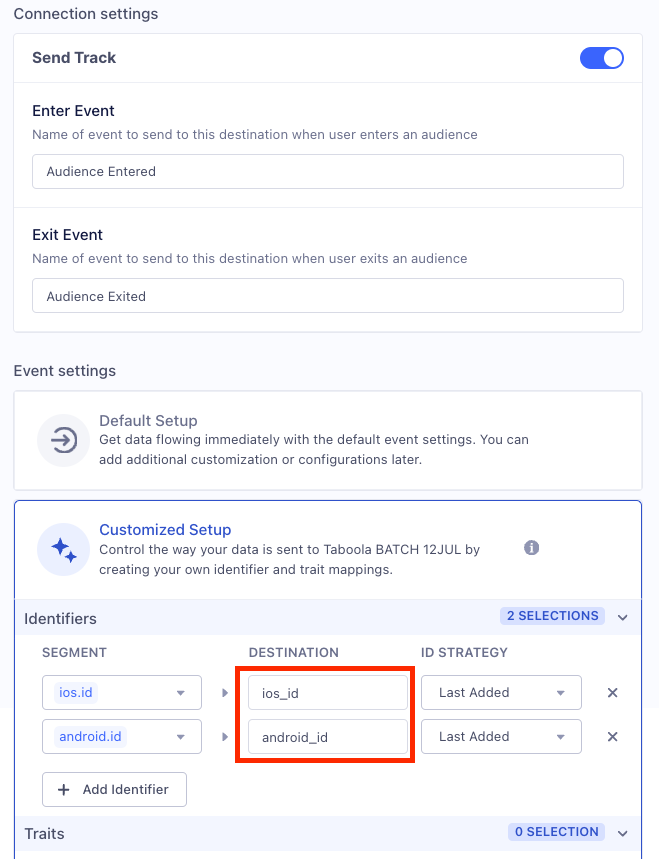



[Taboola](https://developers.taboola.com/backstage-api/reference/create-a-first-party-audience/?utm_source=segmentio&utm_medium=docs&utm_campaign=partners){:target="_blank”} integration allows you to connect and target your Segment audiences with Taboola.

This destination is maintained by Taboola. For any issues with the destination, contact their Support team or your account manager.

## Getting started

### Get Taboola Account Details

Before connecting the **Taboola (Actions)** destination you'll need the following:
1. Your Taboola **Client ID** and **Client Secret** - provided by your Taboola account manager.
2. **Account ID**: retrieve using one of these options:
   * [Taboola Ads](https://ads.taboola.com) - Use the account's alphanumeric name without spaces and in lowercase. For example, 'My Account - Name' would become 'myaccountname'
   * [API](https://developers.taboola.com/backstage-api/reference/get-account-details) - Retrieve Account Details using the Get Account Details API.

### Create and Connect the Taboola Destination

1. From your Segment workspace's [Destination catalog page](https://app.segment.com/goto-my-workspace/destinations/catalog){:target="_blank”} search for **Taboola (Actions)**.
2. Select **Taboola (Actions)** and click **Add Destination**.
3. Next, connect the Engage Space to your **Taboola (Actions)** Destination. To do this, use the `Search for a source` search field to find your Engage Space, then select it. Next, click the **Confirm Source** button.
4. On the **Basic Settings** screen input the Taboola **Client ID** and **Client Secret** values.
5. Enable the Destination using the toggle, then click the **Save Changes** button. 

The **Taboola (Actions)** Destination is now connected to your Engage Space. The next steps cover connecting an Audience to a **Mapping** on your **Taboola (Actions)** Destination.

6. Navigate to the Audience you'd like to sync to **Taboola (Actions)**. 
7. On the **Audience Overview** tab, click the **Add Destination** button, then select the **Taboola (Actions)** Destination. 
8. Under the **Destinations** heading in the **Audience Overview** page you should now see your **Taboola (Actions)** listed. Click the **Add Mapping** button. 

9. When the side panel on the right displays, navigate to the **Settings** tab. 
9. On the **Settings** tab, ensure that **Send Track** is enabled, then populate the Taboola **Account ID** field.

10. Click the **Save** button. 
11. Remain in the side panel, and navigate to the **Matching mappings** tab. Click the **Add mapping** button, then select **Sync Audience**. 
12. On the **Sync Audience** page, click the **Save** button. You'll be taken back to the **Matching mappings** tab. Enable the Mapping using the toggle.   

The Audience will start to sync to Taboola shortly.
It takes another 2-5 days for the segment to scale up and become available for targeting/suppression in Taboola Ads.

> info ""
> To view the audience on the Taboola platform, navigate to the [Taboola Ads audience page](https://ads.taboola.com/audiences), select "Custom Audience" and search for the audience you have just connected.

## Supported identifiers

The **Taboola (Actions)** destination supports syncing Audiences to Taboola using either the `email` and/or the `Mobile Device ID`.
`email` will be automatically included if present. Additional configuration steps are required in order to sync `Mobile Device ID` values. To sync `Mobile Device ID` values ensure the following configuration:  

1. Your Engage Space's identity resolution rules will need to be configured for `android.id` and `ios.id` identifiers. This can be configured by navigating to `Unify` >> `Unify Settings`. 

 
2. Ensure that both the `android.id` and `ios.id` identifiers are configured exactly as per the image below. This configuration step takes place when the Destination is being connected to an Audience. 


